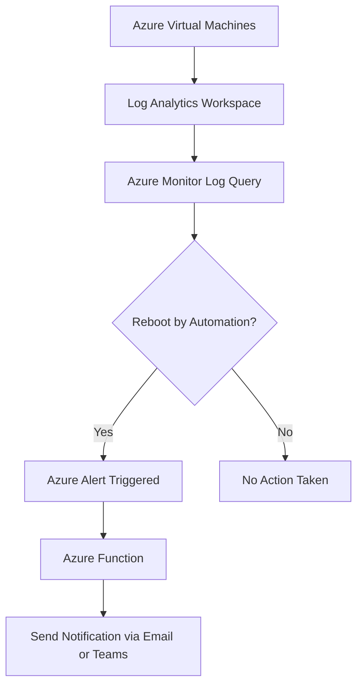

# 🚀 Azure VM Reboot Notifier (Work in Progress)

A serverless solution built on **Azure Functions** and **Azure Monitor** to detect **automated reboots of Azure Virtual Machines** and notify stakeholders (via Email, Teams, Slack, etc.). This project is part of my **DevOps** portfolio and will be further tested and improved as I continue my journey to become a **DevOps Engineer**.  

> ⚠️ **Disclaimer:**  
> This project is currently in the development stage and is **not yet tested in production**. It will undergo further testing and improvements.  

---

## 📊 Architecture

The system uses **Azure Functions**, **Azure Monitor**, and **Log Analytics** to detect automated reboots of Azure VMs.


---

## 📊 Architecture

The system uses **Azure Functions**, **Azure Monitor**, and **Log Analytics** to detect automated reboots of Azure VMs.

### 🏗️ **High-Level Workflow:**

1. **Azure VMs** send activity logs to the **Log Analytics Workspace**.
2. **Azure Monitor** runs a query on the logs to detect any reboot initiated by automation.
3. If a reboot is detected, an **Azure Alert** is triggered.
4. The alert triggers an **Azure Function** which sends a notification to the desired communication channel (Email, Teams, Slack).



---

## 🔍 Detection Logic

The reboot detection is based on the following **Kusto Query Language (KQL)** query, which is used by Azure Monitor to check for reboots triggered by automation systems like Azure Automation or Update Management:

```kusto
AzureActivity
| where OperationNameValue == "Microsoft.Compute/virtualMachines/restart/action"
| where ActivityStatusValue == "Succeeded"
| where Caller contains "automation"
| project TimeGenerated, ResourceGroup, Resource, Caller
```

This query identifies:
- Reboots of virtual machines.
- Status of the reboot action (succeeded).
- Reboots that were initiated by an automation process (e.g., scheduled or scripted).

---

## 🧰 Technologies Used

- **Azure Functions** (Python or C#) for serverless computing.
- **Azure Monitor** for monitoring and alerting.
- **Log Analytics Workspace** for storing and querying logs.
- **Kusto Query Language (KQL)** for log query-based alerts.
- **Notification Systems**: Can send alerts via **Email**, **Teams**, or **Slack**.

---

## 🧪 Setup Instructions

### 1. **Set up Azure Monitor and Log Analytics**
- Create a **Log Analytics Workspace** in your Azure portal.
- Ensure your **Azure Virtual Machines** are configured to send activity logs to the **Log Analytics Workspace**.

### 2. **Create and Configure the Azure Monitor Alert**
- Create a **Log-based Alert** using the KQL query above to detect reboots triggered by automation.
- Configure the alert to trigger a **Webhook** or **Azure Function** when a reboot is detected.

### 3. **Set up Azure Functions**
- Create an **Azure Function** (HTTP Trigger) that will be called by the alert.
- Implement the function to process the incoming alert and send a notification.

### 4. **Configure Notifications**
- Set up the function to send notifications to your chosen platform (Email, Teams, Slack).
- You can use **SendGrid** for email notifications, **Teams Webhooks** for Teams notifications, or a **Slack Webhook** for Slack.

---

## 💡 Future Enhancements

- [ ] **Add email templates** for notifications.
- [ ] Implement **Azure DevOps CI/CD pipelines** for deployment.
- [ ] **Improve error handling** and add retries in the Azure Function.
- [ ] Set up an **Azure Workbook** dashboard to visualize the reboot data.
- [ ] Implement multi-region support for the notification system.
- [ ] Add a **user authentication layer** to control who can modify alert configurations.

---

## 🧪 Status

> ⚠️ **Work in Progress (WIP)**  
> This project is in the development phase and is **not yet tested**. It is included here to demonstrate the **architecture** and **concept** behind the system, and it will undergo further testing and improvements as I move forward with my DevOps learning.

---

## 👤 Author

Toks Detoya  
DevOps Enthusiast | Infra Reliability Engineer @ Manulife  
📫 https://www.linkedin.com/in/alvin-detoya/

---

## 📄 License

This project is licensed under the **MIT License**. See the [LICENSE](LICENSE) file for details.

```

---

### Key Sections in This `README.md`:
- **Project Overview**: Gives a clear summary of what the project does, along with a disclaimer that it’s a work in progress.
- **Architecture**: Contains both the textual explanation and the visual Mermaid diagram showing how the system works.
- **Technologies Used**: Highlights the tools and technologies you're using.
- **Setup Instructions**: A step-by-step guide for setting up the project.
- **Future Enhancements**: A list of planned features, which showcases your ability to think about scalability and improvements.
- **Status**: Reassures potential collaborators or employers that the project is still in development.
- **License**: A standard open-source license that you can adjust if needed.

---

Feel free to copy-paste this into your GitHub `README.md` file. If you need help with specific sections (like setting up the Azure Function or writing code templates), just let me know!
